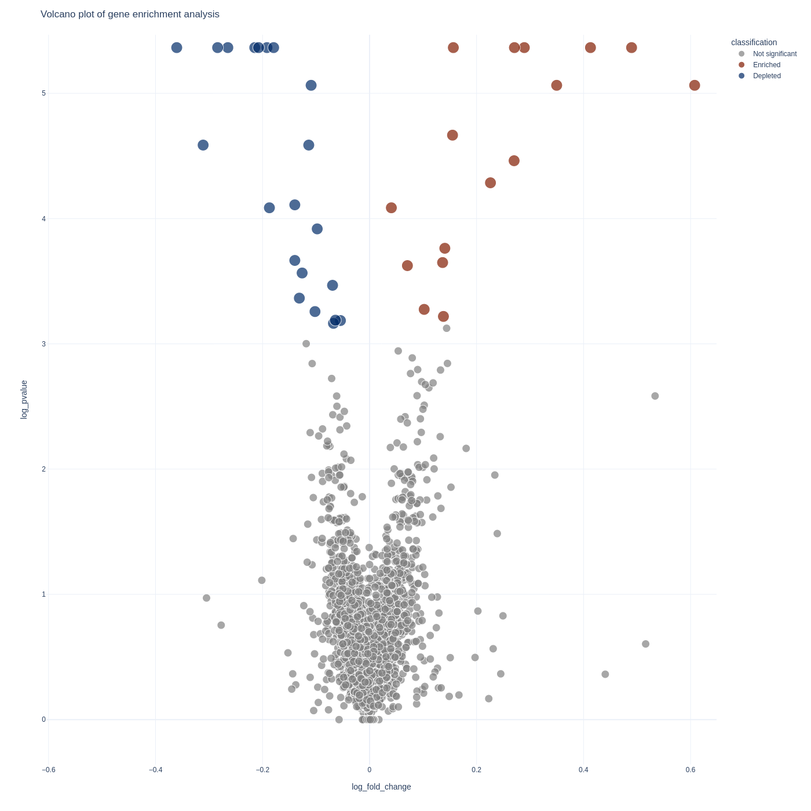
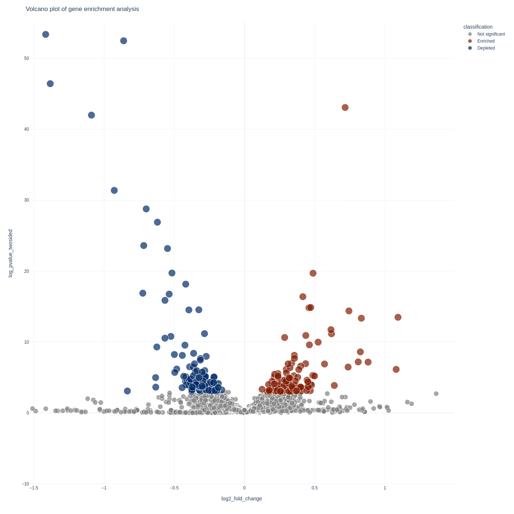

# Visualization

Now we come to the best part - looking at your results!

If you're proficient in python or R this step can be skipped and you can
roll your own visualization method with the `results.gene_results.tab` and
`results.sgrna_results.tab` dataframes.

But if you're looking for a quick visualization toolkit you can use my tool
[`screenviz`](https://github.com/noamteyssier/screenviz)

## Installation

You can install it straight from github with the python package manager `pip`

```bash
pip install git+https://github.com/noamteyssier/screenviz
```

## Usage

### Gene Analysis

To visualize your gene-level results you can use the `screenviz gene` subcommand:

```bash
screenviz gene -i results.gene_results.tab
```

This will write the visualization to a file `gene_volcano.html` which you can open
in your favorite browser to interact with:

```bash
firefox gene_volcano.html
```



### sgRNA Analysis

To visualize your sgrna-level results you can use the `screenviz sgrna` subcommand:

```bash
screenviz sgrna -i results.sgrna_results.tab
```

This will write the visualization to a file `sgrna_volcano.html` which you can open
in your favorite browser to intract with:

```bash
firefox sgrna_volcano.html
```


